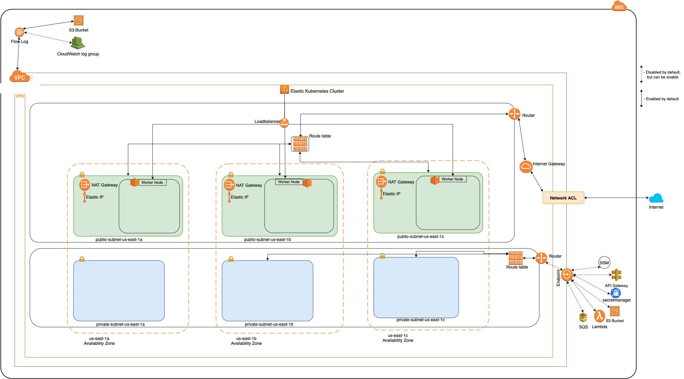

### USAGE

```
provider "aws" {
  region = "us-east-1"
}

module "vpc" {
    source = "../vpc/"
    cidr = "10.0.0.0/16"
    name = "test"
    private_subnets = ["10.0.1.0/24", "10.0.2.0/24", "10.0.3.0/24"]
    public_subnets = ["10.0.101.0/24", "10.0.102.0/24", "10.0.103.0/24"]
    # public_cidrsubnet = "10.0.101.0/16"
    # private_cidrsubnet = "10.0.0.0/16"
    availability_zones = ["us-east-1a","us-east-1b","us-east-1c","us-east-1d","us-east-1e","us-east-1f"]
}
```

### Module Diagram


